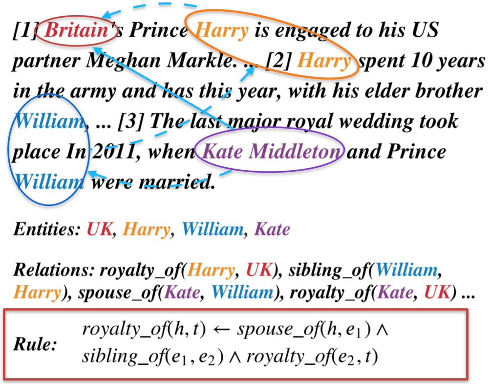
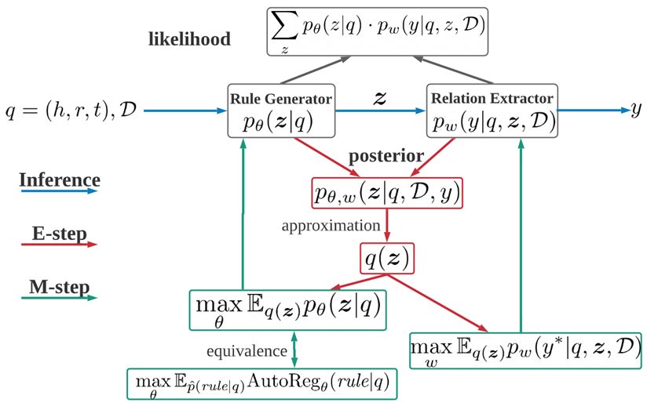
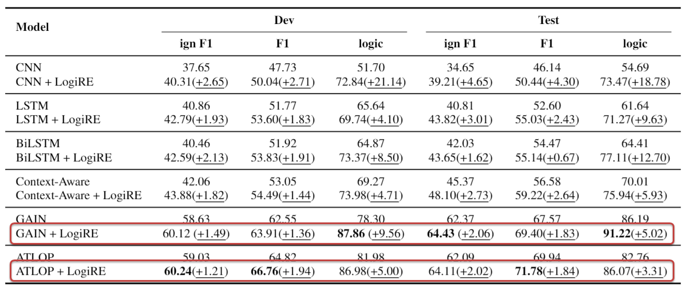
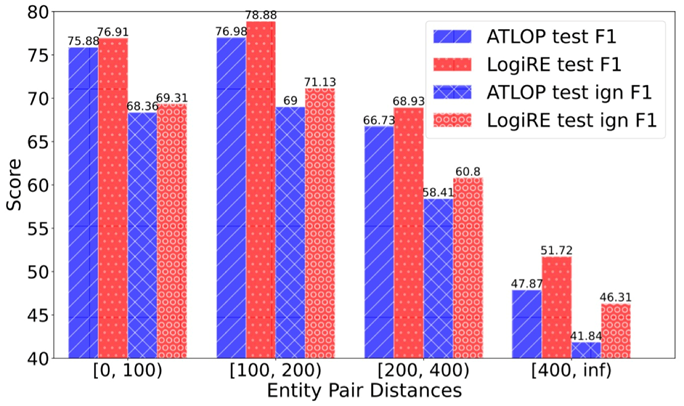

# LogiRE
## Learning Logic Rules for Document-Level Relation Extraction

We propose to introduce logic rules to tackle the challenges of doc-level RE.

Equipped with logic rules, our LogiRE framework can not only explicitly capture long-range semantic dependencies, but also show more interpretability.

We combine logic rules and outputs of neural networks for relation extraction.



As shown in the example, the relation between kate and Britain can be identified according to the other relations and the listed logic rule.

The overview of LogiRE framework is shown below.



## Data

- Download the [preprocessing script and meta data](https://drive.google.com/file/d/10Jgrc_jpWS-TiZhKzTCkigslJq1O1d5X/view?usp=sharing)

    ```
    DWIE
    ├── data
    │   ├── annos
    │   └── annos_with_content
    ├── en_core_web_sm-2.3.1
    │   ├── build
    │   ├── dist
    │   ├── en_core_web_sm
    │   ├── en_core_web_sm.egg-info
    │   ├── MANIFEST.in
    │   ├── meta.json
    │   ├── PKG-INFO
    │   ├── setup.cfg
    │   └── setup.py
    ├── glove.6B.100d.txt
    ├── md5sum.txt
    └── read_docred_style.py
    ```
- Install Spacy (en_core_web_sm-2.3.1)
    ```bash
    cd en_core_web_sm-2.3.1
    pip install .
    ```
- Download the original data from [DWIE](https://github.com/klimzaporojets/DWIE)
- Generate docred-style data
    ```bash
    python3 read_docred_style.py
    ```
    The docred-style doc-RE data will be generated at `DWIE/data/docred-style`. Please compare the `md5sum` codes of generated files with the records in `md5sum.txt` to make sure you generate the data correctly.

## Train & Eval

### Requirements

- pytorch >= 1.7.1
- tqdm >= 4.62.3
- transformers >= 4.4.2

### Backbone Preparation

The LogiRE framework requires a backbone NN model for the initial probabilistic assessment on each triple.

The probabilistic assessments of the backbone model and other related meta data should be organized in the following format. In other words, please train any doc-RE model with the docred-style RE data before and dump the outputs as below.

```
{
    'train': [
        {
            'N': <int>,
            'logits': <torch.FloatTensor of size (N, N, R)>,
            'labels': <torch.BoolTensor of size (N, N, R)>,
            'in_train': <torch.BoolTensor of size (N, N, R)>,
        },
        ...
    ],
    'dev': [
        ...
    ]
    'test': [
        ...
    ]
}
```

Each example contains four items:
- N: the number of entities in this example.
- logits: the logits of all triples as a tensor of size (N, N, R). R is the number of relation types (Na excluded)
- labels: the labels of all triples as a tensor of size (N, N, R). 
- in_train: the in_train masks of all triples as a tensor of size(N, N, R), used for ign f1 evaluation. `True` indicates the existence of the triple in the training split.

For convenience, we provide the [dump of ATLOP](https://drive.google.com/file/d/15_L0JN4ovtfnAt0T7SaUB5fF0xtRvcxI/view?usp=sharing) as examples. Feel free to download and try it directly.

### Train

```
python3 main.py --mode train \
    --save_dir <the directory for saving logs and checkpoints> \
    --rel_num <the number of relation types (Na excluded)> \
    --ent_num <the number of entity types> \
    --n_iters <the number of iterations for optimization> \
    --max_depth <max depths of the logic rules> \
    --data_dir <the directory of the docred-style data> \
    --backbone_path <the path of the backbone model dump>
```

### Evaluation

```
python3 main.py --mode test \
    --save_dir <the directory for saving logs and checkpoints> \
    --rel_num <the number of relation types (Na excluded)> \
    --ent_num <the number of entity types> \
    --n_iters <the number of iterations for optimization> \
    --max_depth <max depths of the logic rules> \
    --data_dir <the directory of the docred-style data> \
    --backbone_path <the path of the backbone model dump>
```

## Results

- LogiRE framework outperforms strong baselines on both relation performance and logical consistency.
    
    

- Injecting logic rules can improve long-range dependencies modeling, we show the relation performance on each interval of different entity pair distances. LogiRE framework outperforms the baseline and the gap becomes larger when entity pair distances increase. Logic rules actually serve as shortcuts for capturing long-range semantics in concept-level instead of token-level.

    

## Acknowledgements

We sincerely thank [RNNLogic](https://arxiv.org/abs/2010.04029) which largely inspired us and [DWIE](https://arxiv.org/abs/2010.04029) & [DocRED](https://arxiv.org/abs/1906.06127) for providing the benchmarks.

## Reference
```
@inproceedings{ru-etal-2021-learning,
    title = "Learning Logic Rules for Document-Level Relation Extraction",
    author = "Ru, Dongyu  and
      Sun, Changzhi  and
      Feng, Jiangtao  and
      Qiu, Lin  and
      Zhou, Hao  and
      Zhang, Weinan  and
      Yu, Yong  and
      Li, Lei",
    booktitle = "Proceedings of the 2021 Conference on Empirical Methods in Natural Language Processing",
    month = nov,
    year = "2021",
    address = "Online and Punta Cana, Dominican Republic",
    publisher = "Association for Computational Linguistics",
    url = "https://aclanthology.org/2021.emnlp-main.95",
    pages = "1239--1250",
}
```